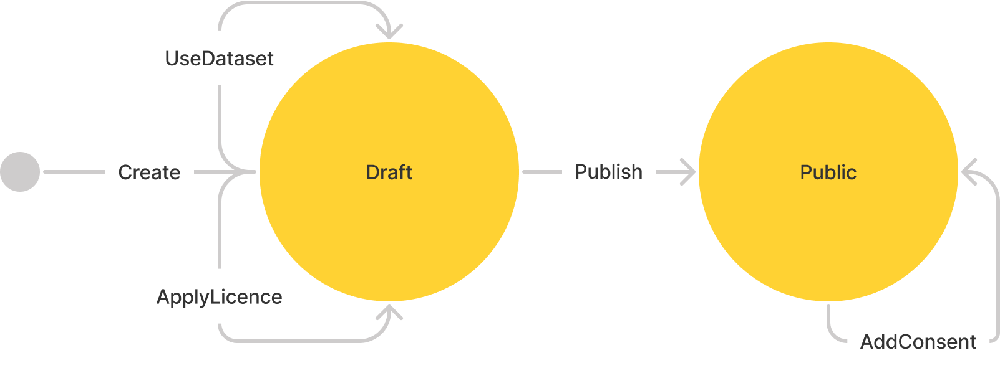

# Welcome to lrtzc

## Project Structure

```
├── 
│   ├── trace                         --> Module of trace automate
│   │   ├── trace-s2                  --> Commons code for the the trace s2 automate and rest api  
│   │   ├── trace-s2-cassandra-api    --> Spring boot configuration for cassandra database
│   │   ├── trace-s2-ssm-api          --> Spring boot configuration for ssm blockchain
│   ├── usecase                       --> Module of usecase automate
│   │   ├── usecase-s2-ssm-api        --> Trace s2 automate and spring boot configuration for ssm blockchain
```
### Build code

```
./gradlew clean build
```

### Package docker images
```
make package -e VERSION=experimental
```

Packaged images are: 
 * smartbcity/lrtzc-trace-s2-cassandra-api:experimental
 * smartbcity/lrtzc-trace-s2-ssm-api:experimental
 * smartbcity/lrtzc-usecase-s2-ssm-api:experimental

## Trace 


### Api

* Log Changes for an object with id
```
POST http://localhost:{PORT}/traces
Content-Type: application/json

{
  "id": "id1",
  "payload":{
    "key1": "value1",
    "key2": "value2"
  }
}
```

* Get the logs of an object

```
GET http://localhost:$PORT/traces/$ID
```

#### Start api for Cassandra

 * Start cassandra
```yaml
docker-compose -f docker-compose-cassandra.yml up -d
```

 * Start lrtzc-trace-s2-cassandra-api
```yaml
docker-compose -f docker-compose-api.yml up -d lrtzc-trace-s2-cassandra-api
```

 * Use curl with params
```
PORT=8001
```

#### Start api for Ssm

* Start blockchain with ssm chaincode
```yaml
docker-compose -f docker-compose-bclan-it.yml up -d
```

* Start lrtzc-trace-s2-ssm-api
```yaml
docker-compose -f docker-compose-api.yml up -d lrtzc-trace-s2-ssm-api
```

* Use curl with params
```
PORT=8002
```

### Curl Client

 * Port
```
# For cassandra api
export PORT=8001

# For ssm api
export PORT=8002
```

 * 
```bash
ID=1; PORT=8001; curl -i -X POST -H "Content-Type: application/json" \
-d "{\"id\": \"$ID\",\"payload\":{\"key1\": \"value1\",\"key2\": \"value2\"}}" \
 http://localhost:$PORT/traces
```

```bash
ID=1; PORT=8001; curl -i -X GET  http://localhost:$PORT/traces/$ID
```


## Usecase


### Api

 * create
```
POST http://localhost:{PORT}/usecases/create
Content-Type: application/json

{
  "name": "TheName",
  "creator": "TheCreatorId"
}

```  
 * useDataset
```
POST http://localhost:{PORT}/usecases/usedataset
Content-Type: application/json

{
  "id": "TheId",
  "dataSetId": "TheDataId"
}
```

 * applyLicence
```
POST http://localhost:{PORT}/usecases/applylicence
Content-Type: application/json

{
  "id": "TheId",
  "licenceId": "TheLicenceId"
}
```

 * publish
```
POST http://localhost:{PORT}/usecases/publish
Content-Type: application/json

{
    "id": "TheId"
}
```

 * addConsent
```
POST http://localhost:{PORT}/usecases/addconsent
Content-Type: application/json
{
  "id": "TheId",
  "consentOf": "AUserID"
}
```

 * Get UseCase
```
GET http://localhost:$PORT/usecase/$ID
```

### Start APi

* Start blockchain with ssm chaincode
```yaml
docker-compose -f docker-compose-bclan-it.yml up -d
```

* Start lrtzc-trace-s2-ssm-api
```yaml
docker-compose -f docker-compose-api.yml up -d  lrtzc-usecase-s2-ssm-api
```


### Curl Client

 * Params
```bash
export ID=25
export ACTION=create
export BODY="{\"id\": \"$ID\",\"name\": \"TheName\",\"creator\": \"TheCreatorId\"}"
  
export ACTION=usedataset
export BODY="{\"id\": \"$ID\",\"dataSetId\": \"TheDataId\"}"

export ACTION=applylicence
export BODY="{\"id\": \"$ID\",\"licenceId\": \"TheLicenceId\"}"

export ACTION=publish
export BODY="{\"id\": \"$ID\"}"

export ACTION=addconsent
export BODY="{\"id\": \"$ID\",\"consentOf\": \"AUserID\"}"
```

* curl post

```bash
curl -i -X POST -H "Content-Type: application/json" \
-d $BODY \
 http://localhost:8003/usecases/$ACTION
```
```

* curl get

```bash
curl http://localhost:8003/usecases/$ID
```

## Docker 

In order to allow docker images communication, an external docker network must be created:

```
docker network create bclannet-it 
```