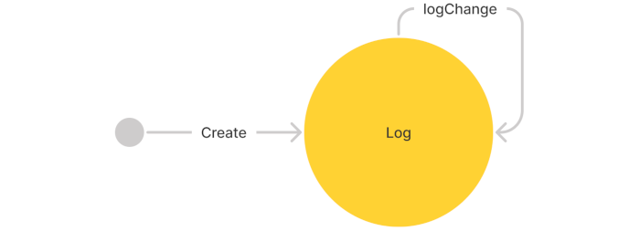

# Tracabilité SmartB

## Utilisation du l'api bash d'Hyperledger Fabric

Mise en place d'une machine a états simple



```json
{
  "name": "TraceMachine",
  "transitions": [
    {
      "from": 0, "to": 0, "role": "Operator", "action": "LogChange"
    }
  ]
}
```


  
### Tracabilité sur la blockchain

#### Démarrer une blockchain de test

* Créer docker-compose-bclan.yml

```yaml
version: '3.7'

services:
  ca.bc-coop.bclan:
    container_name: ca-bclan-network-it
    image: smartbcity/commune-sandbox-ca:latest
    networks:
      - bclannet-it

  orderer.bclan:
    container_name: orderer-network-it
    image: smartbcity/commune-sandbox-orderer:latest
    networks:
      - bclannet-it

  couchdb.bc-coop.bclan:
    container_name: couchdb
    image: couchdb:3.1.2
    environment:
      - COUCHDB_USER=couchdb
      - COUCHDB_PASSWORD=couchdb
    ports:
      - "5984:5984"
    networks:
      - bclannet-it
    depends_on:
      - orderer.bclan

  peer0.bc-coop.bclan:
    container_name: peer0-bclan-network-it
    image: smartbcity/commune-sandbox-peer:latest
    environment:
      - CORE_VM_ENDPOINT=unix:///host/var/run/docker.sock
      - CORE_VM_DOCKER_HOSTCONFIG_NETWORKMODE=bclannet-it
      - CORE_LEDGER_STATE_STATEDATABASE=CouchDB
      - CORE_LEDGER_STATE_COUCHDBCONFIG_COUCHDBADDRESS=couchdb:5984
      - CORE_LEDGER_STATE_COUCHDBCONFIG_USERNAME=couchdb
      - CORE_LEDGER_STATE_COUCHDBCONFIG_PASSWORD=couchdb
    volumes:
      - /var/run/docker.sock:/host/var/run/docker.sock
    networks:
      - bclannet-it
    depends_on:
      - couchdb.bc-coop.bclan

  coop-rest-java:
    container_name: coop-rest-bclan-network-it
    image: smartbcity/commune-sandbox-ssm-rest:experimental
    environment:
      - i2_jwt-issuer-uri=
    ports:
      - 9090:9090
    networks:
      - bclannet-it
    depends_on:
      - peer0.bc-coop.bclan

  cli.bc-coop.bclan:
    container_name: cli-bclan-network-it
    image: smartbcity/commune-sandbox-cli:latest
   command: /bin/bash
    networks:
      - bclannet-it
    depends_on:
      - coop-rest-java

  cli-init.bc-coop.bclan:
    container_name: cli-init-bclan-network-it
    image: smartbcity/commune-sandbox-cli:latest
    command: /opt/commune-sandbox/util/init.sh
    networks:
      - bclannet-it
    depends_on:
      - coop-rest-java


networks:
  bclannet-it:
    name: bclannet-it

```

 * Démarrer la blockchain

```bash
docker-compose -f docker-compose-bclan.yml up -d
```

 * Vérifier le fonctionnement
```bash
curl -X GET "http://localhost:9090/?args=admin&cmd=query&fcn=list" -H "accept: application/json"

=> return
["ssm-admin"]
```

#### Utiliser un bash pre-configuré

```bash
docker run --network=bclannet-it -it smartbcity/commune-sandbox-cli:experimental /bin/bash
```

* Dans le bash du docker
```bash
source /opt/commune-sandbox/util/env
cd /opt/commune-sandbox/user
```

#### Créer une machine a états
 * Créer l'automate TraceMachine
```bash
echo '{
  "name": "TraceMachine",
  "transitions": [
    {
      "from": 0, "to": 0, "role": "Logger", "action": "LogChange"
    }
  ]
}' > tracemachine.json
peer chaincode invoke -o ${ORDERER_ADDR} -C ${CHANNEL} -n ${CHAINCODE} --tls --cafile ${ORDERER_CERT} -c "$(create tracemachine ssm-admin)"
```
#### Déclarer un utilisateur bob
```
peer chaincode invoke -o ${ORDERER_ADDR} -C ${CHANNEL} -n ${CHAINCODE} --tls --cafile ${ORDERER_CERT} -c "$(register bob ssm-admin)"
```

#### Démarrer la session trace_usecase_1
```
echo '{
"ssm": "tracemachine",
"session": "trace_usecase_1",
"roles": {
"bob": "Logger"
}
}' > trace_usecase_1.json
peer chaincode invoke -o ${ORDERER_ADDR} -C ${CHANNEL} -n ${CHAINCODE} --tls --cafile ${ORDERER_CERT} -c "$(start trace_usecase_1 ssm-admin)"
```

#### Trace step 1
```
echo '{
"session": "trace_usecase_1",
"public": "JSON WITH CHANGES OR the HASH Of the changes",
"iteration": 0
}' > state1.json
peer chaincode invoke -o ${ORDERER_ADDR} -C ${CHANNEL} -n ${CHAINCODE} --tls --cafile ${ORDERER_CERT} -c "$(perform LogChange state1 bob)"
```

#### Trace step 1
```
echo '{
"session": "trace_usecase_1",
"public": "JSON WITH CHANGES OR the HASH Of the changes",
"iteration": 1
}' > state1.json
peer chaincode invoke -o ${ORDERER_ADDR} -C ${CHANNEL} -n ${CHAINCODE} --tls --cafile ${ORDERER_CERT} -c "$(perform LogChange state1 bob)"
```

### Réquéter la blockchain

* Lister les admins
```
peer chaincode query -C ${CHANNEL} -n ${CHAINCODE} -c '{"Args":["list", "admin"]}'
```

* Lister les utilisateurs
```
peer chaincode query -C ${CHANNEL} -n ${CHAINCODE} -c '{"Args":["list", "user"]}'
```

* Lister les automates
```
peer chaincode query -C ${CHANNEL} -n ${CHAINCODE} -c '{"Args":["list", "ssm"]}'
```

* Lister les sessions
```
peer chaincode query -C ${CHANNEL} -n ${CHAINCODE} -c '{"Args":["list", "session"]}'
```

* Loguer l'historique d'une session
```
peer chaincode query -C ${CHANNEL} -n ${CHAINCODE} -c '{"Args":["log", "carsale20190301"]}'
```
